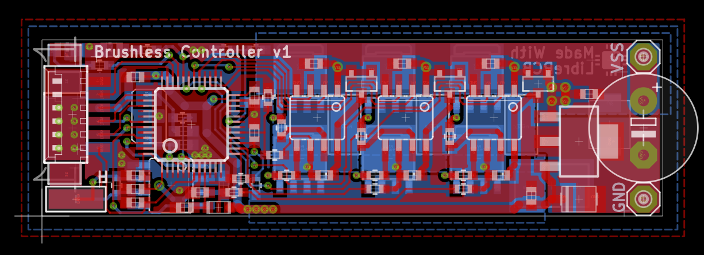

# STM32 Brushless Controller

## Description

This is a [LibrePCB](http://librepcb.org) project for a Brushless Controller
PCB based on a STM32 microcontroller.

## Preview

## License

See [LICENSE.txt](LICENSE.txt).
